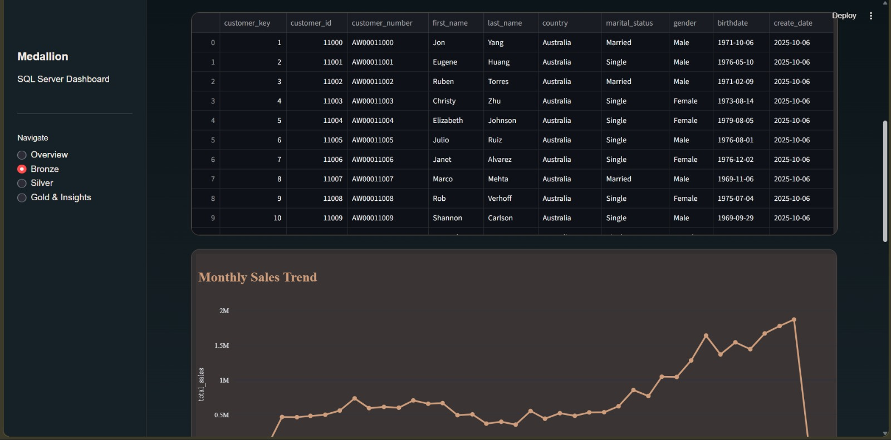
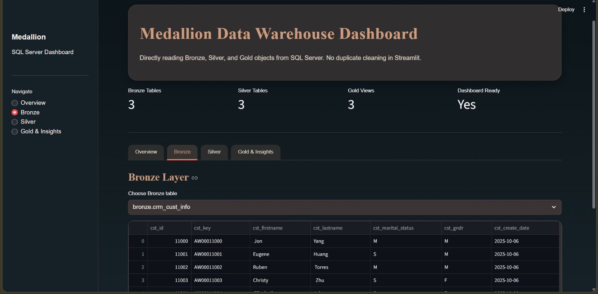

# 📊 Data Warehouse and Analytics Project

Welcome to the **Data Warehouse and Analytics Project** repository! 🚀  

This project demonstrates a complete data warehousing and analytics solution — from building a data warehouse to generating actionable insights.

It is designed as a **portfolio project** showcasing best practices in **data engineering and analytics**.

---

## 🏗️ Data Architecture


This project follows the **Medallion Architecture** approach:

### 🥉 Bronze Layer
- Stores raw data directly from source systems  
- Data is ingested from CSV files into SQL Server  

### 🥈 Silver Layer
- Performs:
  - Data cleaning  
  - Standardization  
  - Normalization  
- Prepares data for analysis  

### 🥇 Gold Layer
- Contains business-ready data  
- Uses **star schema** for reporting and analytics  

---

## 📖 Project Overview

This project includes:

- **Data Architecture**  
  Designing a modern warehouse using Medallion Architecture  

- **ETL Pipelines**  
  Extracting, transforming, and loading data  

- **Data Modeling**  
  Creating fact and dimension tables  

- **Analytics & Reporting**  
  SQL-based reports and dashboards  

---

## 🎯 Skills Demonstrated

This repository is ideal for showcasing:

- SQL Development  
- Data Architecture  
- Data Engineering  
- ETL Pipeline Development  
- Data Modeling  
- Data Analytics  

---

## 🛠️ Tools & Resources

All tools used are free:

- 📁 Datasets (CSV files)  
- 🗄️ SQL Server Express  
- 🧰 SQL Server Management Studio (SSMS)  
- 🌐 GitHub (Version control)  
- 📊 Draw.io (Architecture & diagrams)  
- 📝 Notion (Project management templates)  

---

## 🚀 Project Requirements

### 🔧 Data Engineering

**Objective:**  
Build a modern data warehouse to analyze sales data.

**Specifications:**
- Import data from ERP & CRM (CSV files)  
- Clean and resolve data quality issues  
- Integrate into a unified data model  
- Focus on latest dataset (no historization)  
- Provide clear documentation  

---

### 📊 Data Analysis (BI)

**Objective:**  
Generate insights using SQL:

- Customer Behavior  
- Product Performance  
- Sales Trends  

---

## 📂 Repository Structure
```
data-warehouse-project/
│   
├── datasets/ # Raw ERP & CRM datasets
│
├── docs/ # Documentation & diagrams
│ ├── etl.drawio
│ ├── data_architecture.drawio
│ ├── data_catalog.md
│ ├── data_flow.drawio
│ ├── data_models.drawio
│ ├── naming-conventions.md
│
├── scripts/ # SQL scripts
│ ├── bronze/ # Raw data loading
│ ├── silver/ # Data transformation
│ ├── gold/ # Analytical models
│
├── tests/ # Testing & validation
│
├── README.md
├── LICENSE
├── .gitignore
└── requirements.txt
```
# SnapShots


